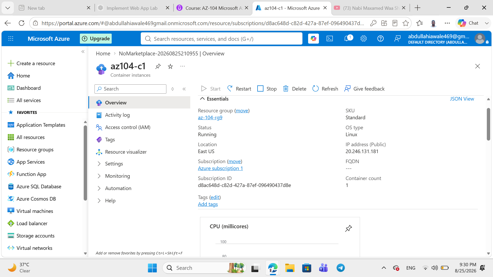
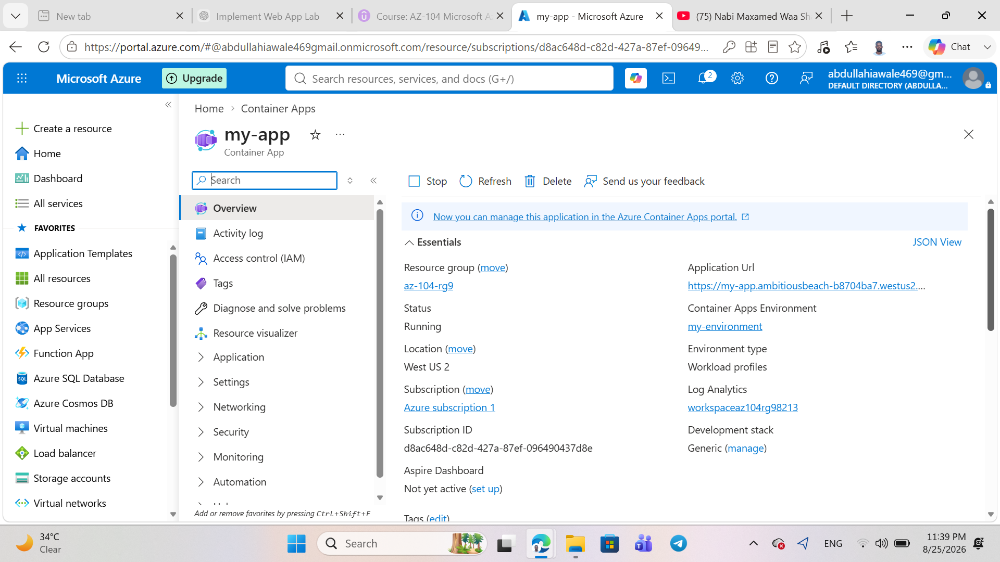
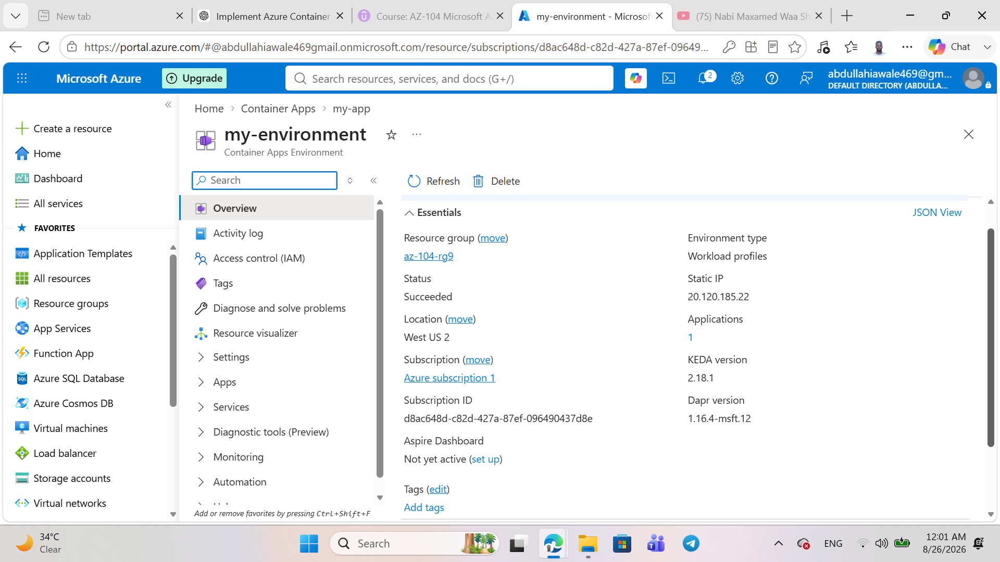
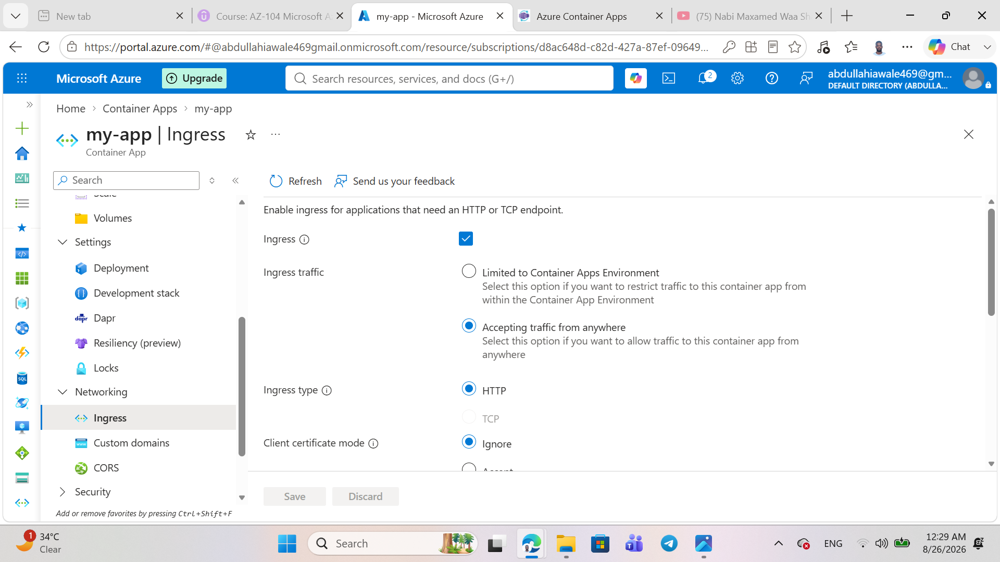

## 1. Open Azure Container Apps

I opened the Azure Portal and selected **Container Apps**.

## 2. Configure Basics

I configured the Container App with the following settings:

- Resource Group: `az104-rg9`
- Container App Name: `my-app`
- Region: `East US`

## 3. Create Container Apps Environment

I created a new Container Apps Environment named `my-environment`.

## 4. Configure Container

I enabled the quickstart image and selected **Simple hello world container**.

## 5. Configure Application Ingress

I enabled application ingress and configured the application to accept external traffic on port `80`.

## 6. Review and Create

I reviewed the configuration and verified that the validation passed before creating the Container App.

## 7. Deployment Completed

The Azure Container App deployment completed successfully.

## 8. Container App Overview

After deployment, I opened the Container App overview and verified the Application URL.

## 9. Test the Application

I opened the Application URL in a browser and verified that the Hello World application was running successfully.

