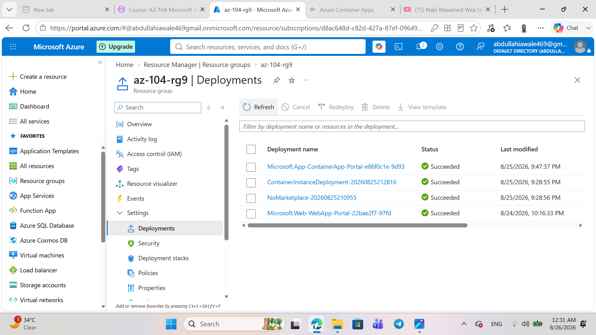

# LAB 09c - Implement Azure Container Apps

## Objective

In this lab, I implemented and deployed an Azure Container App using Azure Portal.

## Architecture

Azure Subscription
    ↓
Resource Group: az104-rg9
    ↓
Container Apps Environment: my-environment
    ↓
Container App: my-app
    ↓
Simple Hello World Container
    ↓
Application URL

## Task 1: Create Azure Container App

### Resource Group

`az104-rg9`

### Container App

Container App name:

`my-app`

Region:

`East US`

### Container Apps Environment

Environment name:

`my-environment`

### Container Image

Quickstart image:

`Simple hello world container`

### Application Ingress

Ingress was enabled to allow external traffic.

Port:

`80`

## Task 2: Test and Verify

The deployment completed successfully.

The Container App was running successfully.

I opened the Application URL and verified that the Hello World application was displayed.

## Key Takeaways

- Azure Container Apps is a serverless platform for running containerized applications.
- Container Apps reduces the need to manage infrastructure.
- Container Apps supports long-running applications and microservices.
- Application ingress allows users to access the application over the internet.
- The application was successfully deployed using the Simple Hello World container.
